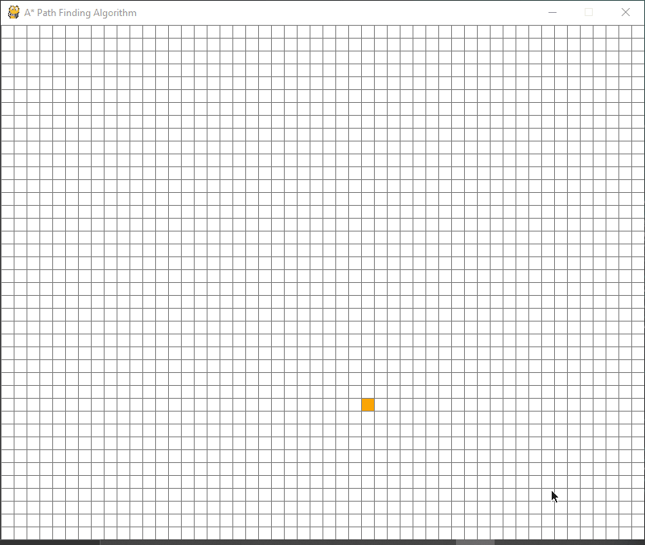

# astar-pathfinding-visualiser
A* is a graph traversal and path search algorithm. At each iteration of its main loop, A* needs to determine which of its paths to extend. It does so based on the cost of the path and an estimate of the cost required to extend the path all the way to the goal. Specifically, A* selects the path that minimizes: <em>f(n)=g(n)+h(n)</em> 

## About the project
astar-visualiser is a simple application made using pygame to visulaise how the algorithm works.

<ul>
  <li>Left-click to set start and end points and barriers</li>
  <li>Right-click to erase barriers</li>
  <li>SPACE to start the algorithm </li>  
</ul>
